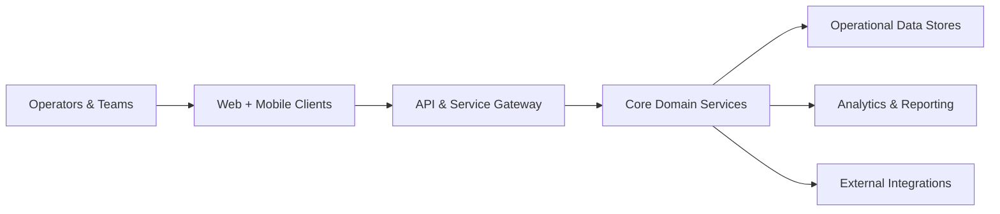
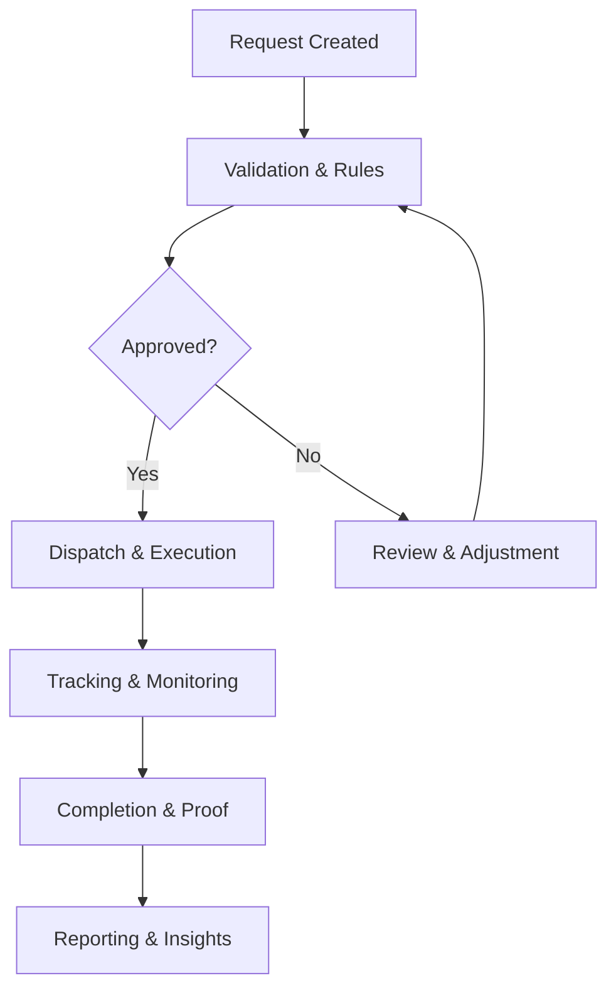
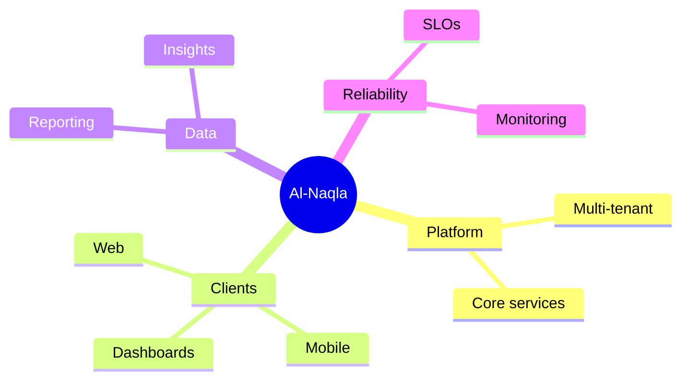
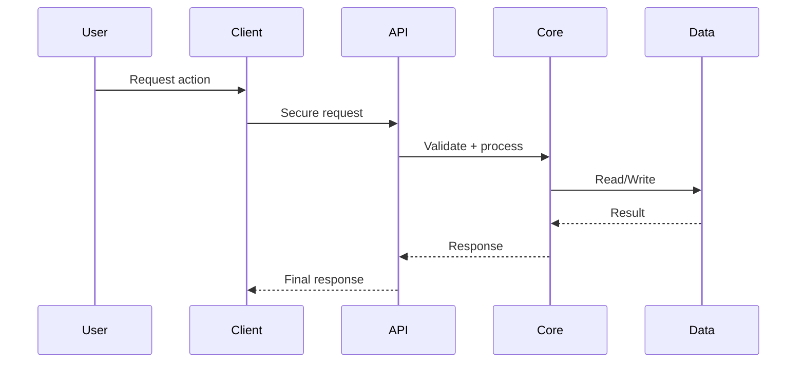
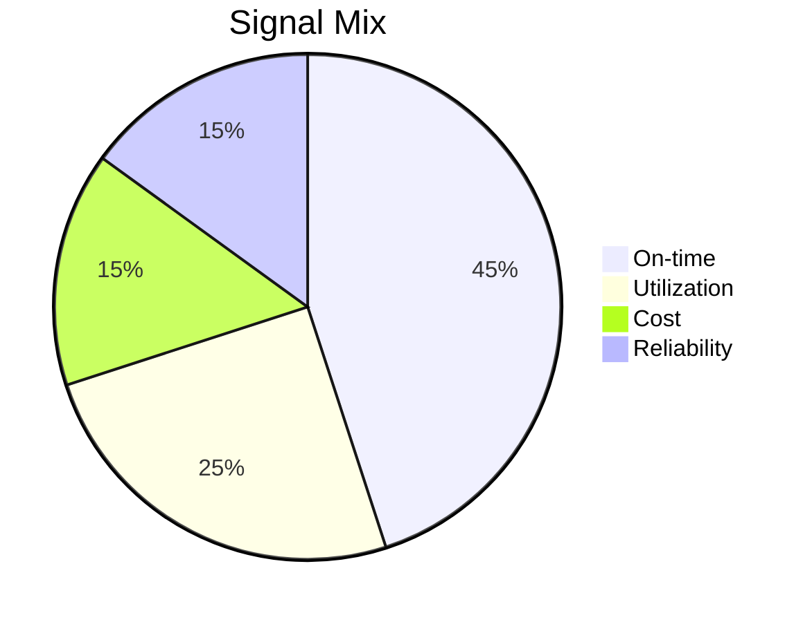
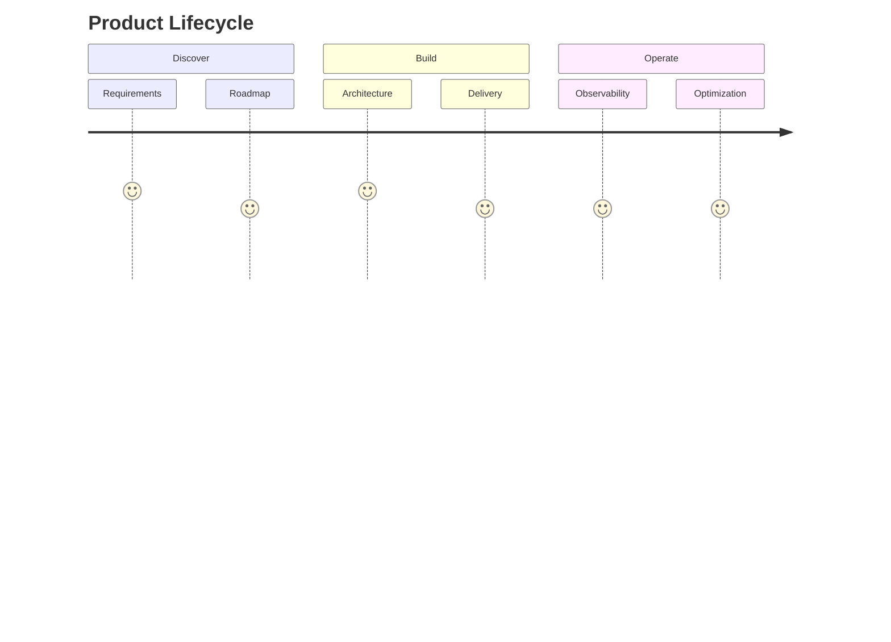
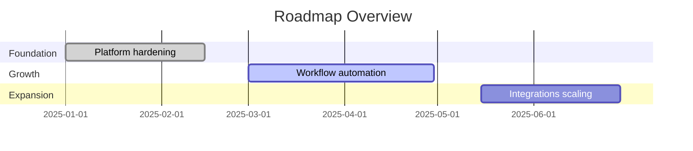
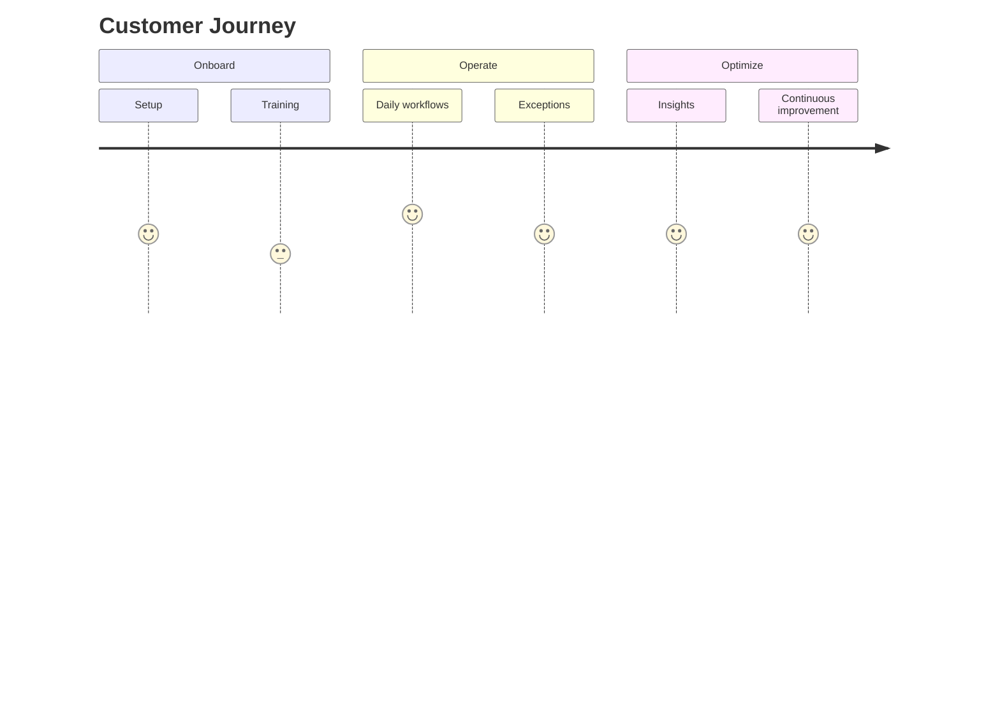

# Al-Naqla Organization

---

## 🌍 Mission
Build transport and logistics platforms that improve operational clarity, reliability, and scale across teams and regions.

## ✅ What We Deliver
- **Operational orchestration** for transport workflows
- **Data-driven visibility** for decision makers
- **Cross-platform experiences** for teams in motion
- **Secure, maintainable systems** with clear governance

---

## 🧭 High-Level Architecture

## 🔁 Operational Flow (Abstract)

---

## 📈 Analytics Themes (Abstracted)
| Theme | Outcomes |
|---|---|
| Service Quality | On-time trends and exception insights |
| Utilization | Resource balance and usage signals |
| Cost Efficiency | Route impact and cost drivers |
| Reliability | SLA adherence and stability indicators |

---

## 🎨 Visual Overview

---

## 🧩 Engineering Principles
- **Clear separation of concerns** across services and clients
- **Observability-first** instrumentation and monitoring
- **Security and privacy by design**
- **Reproducible environments** and documented workflows

---

## 🧭 Service Flow (Abstract)

---

## 🧰 Platform Capabilities

| 🧠 Platform Core | 🛰️ Integrations | 📱 Client Apps |
| :---: | :---: | :---: |
| Multi-tenant foundations and shared services | External system connectivity | Web, mobile, and dashboard experiences |

| 📊 Insights | 🧪 Quality | 🔐 Security |
| :---: | :---: | :---: |
| Operational reporting and analytics | Testing & release gates | Privacy-first, policy-driven access |

---

## 📊 Performance Signals (Illustrative)

---

## 🗺️ Repository Landscape (High-Level)
- **Backend platform** for domain logic and integrations
- **Client applications** for operations and administration
- **Shared tooling** for automation and deployments

---

## 🎯 Vision
Create a unified logistics ecosystem where operations, insights, and execution stay perfectly aligned.

---

## 🧱 Strategic Pillars
1. **Operational Excellence** — predictable, efficient workflows
2. **Transparency** — real-time visibility for every stakeholder
3. **Scalability** — multi-tenant design for growing organizations
4. **Reliability** — stable services with continuous monitoring

---

## 🧭 Product Lifecycle (Abstract)

---

## 🧪 Quality & Delivery
- **Automated checks** across build, test, and release
- **Consistent environments** via containerized workflows
- **Release discipline** with rollback strategies

---

## 🔐 Security & Privacy
- **Least-privilege access** and policy-driven controls
- **Data protection** aligned with modern compliance practices
- **Auditability** for operational transparency

---

## 📊 KPI Focus (Illustrative)
| KPI | Definition |
|---|---|
| On-time completion | % of tasks delivered on schedule |
| Utilization rate | Resource usage vs capacity |
| Exception rate | Incidents per operation |
| SLA adherence | Service availability and response |

---

## 🗺️ Roadmap (High-Level)

---

## 💼 Operating Model
- **Product-led delivery** with clear discovery → build → operate loops
- **Cross-functional teams** aligned to outcomes
- **Service ownership** with defined SLOs

---

## 🧪 Reliability Playbook (Abstract)
- **Monitoring & alerting** across critical paths
- **Incident response** with post-incident reviews
- **Capacity planning** to sustain growth

---

## 💡 Value Highlights
- **Faster decisions** via real-time operational visibility
- **Lower friction** through automation of repetitive tasks
- **Better coordination** across multi-tenant environments

---

## 🧭 Customer Journey (Abstract)

---

## 🧩 Technology Domains (Abstract)

| 🧠 Domain | 🔍 Focus |
|---|---|
| Platform Services | Multi-tenant core, shared services |
| Client Experiences | Web, mobile, dashboards |
| Integrations | External systems and partners |
| Data & Insights | Reporting and analytics |

---

## 🌟 Success Signals (Illustrative)
| Signal | Target | Notes |
|---|---|---|
| Operational uptime | 99.9% | Service continuity |
| Release cadence | Weekly | Controlled deployments |
| Response time | < 200ms | API critical paths |

---

## 🤝 Partners & Ecosystem

---

## ❓ FAQs
**Q: Is this profile public?**  
A: Yes, it provides a high-level overview only.

**Q: Do you share internal details?**  
A: No, implementation specifics remain private.

**Q: Can partners collaborate?**  
A: Yes, contact us to explore aligned opportunities.

---

## 🤝 Collaboration
We welcome aligned partnerships and technical collaboration.

**Contact:** info@al-naqla.com

---

## 👥 Team

| Team Member | Role | Links |
|---|---|---|
|    **Name Placeholder** | Role Placeholder | [GitHub](#) · [LinkedIn](#) · [Other](#) |
|    **Name Placeholder** | Role Placeholder | [GitHub](#) · [LinkedIn](#) · [Other](#) |
|    **Name Placeholder** | Role Placeholder | [GitHub](#) · [LinkedIn](#) · [Other](#) |

**Template for later updates:**

- Name:
  Role:
  Photo URL:
  GitHub:
  LinkedIn:
  Other:

